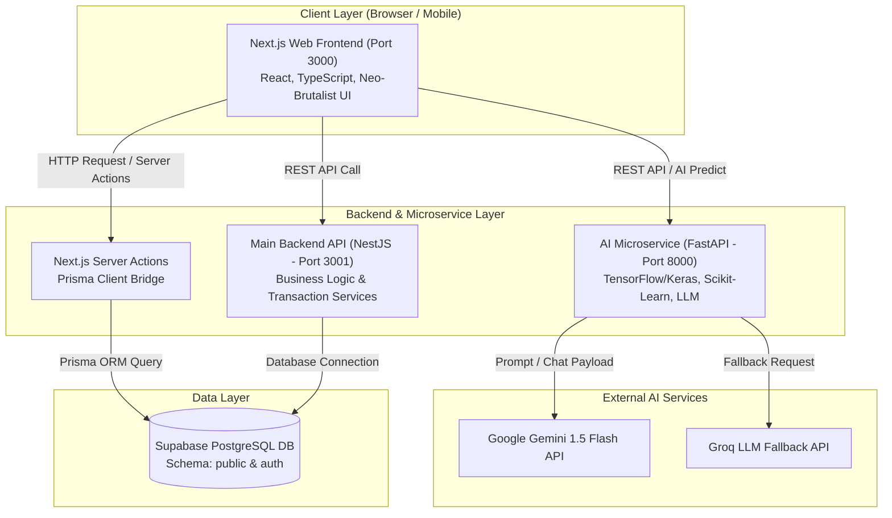
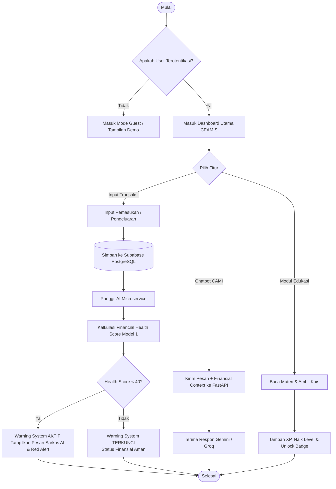
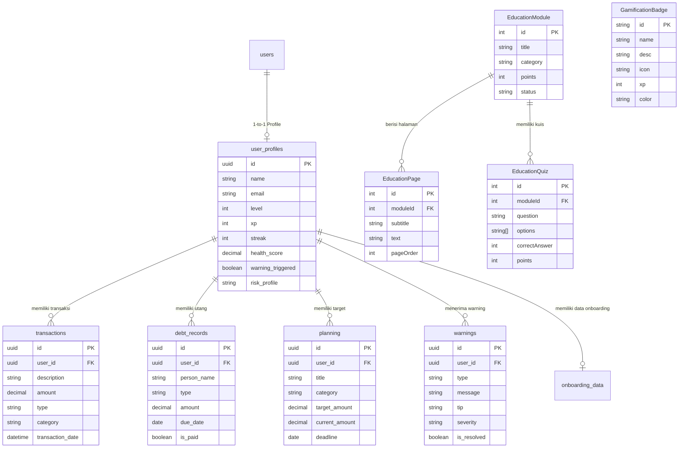

# BAB III
# ANALISIS DAN PERANCANGAN SISTEM

## A. Analisis Kebutuhan Sistem

Analisis kebutuhan sistem dirumuskan berdasarkan eksplorasi arsitektur dan fungsionalitas kode program yang diimplementasikan pada aplikasi CEAMIS. Kebutuhan dikelompokkan ke dalam kebutuhan fungsional (*functional requirements*) dan kebutuhan non-fungsional (*non-functional requirements*).

### 1. Kebutuhan Fungsional (Functional Requirements)
Kebutuhan fungsional menggambarkan seluruh layanan dan fitur yang dapat dilakukan oleh sistem CEAMIS, antara lain:

1. **Modul Autentikasi dan Profil Pengguna (F-01):**
   * Sistem mampu memfasilitasi autentikasi pengguna (*login/register/logout*) terintegrasi Supabase Auth.
   * Sistem mampu menyimpan dan menampilkan profil pengguna mencakup nama, email, level, XP, jumlah *streak*, *health_score*, serta daftar lencana yang diraih.
   * Sistem menyediakan mode *Guest* untuk uji coba terbatas dan mode *User* terotentikasi.

2. **Modul Pencatatan Transaksi & Digital Ledger Utang (F-02):**
   * Sistem mampu mencatat transaksi harian (pemasukan dan pengeluaran) lengkap dengan nilai, jenis, kategori, tag, dan tanggal transaksi.
   * Sistem mampu mengelola catatan utang-piutang (*digital debt ledger*) mencakup nama pihak, jumlah nominal, tanggal jatuh tempo, dan status pelunasan.

3. **Modul Analisis AI & Explainable AI (XAI) (F-03):**
   * Sistem mampu memprediksi Skor Kesehatan Finansial (*Financial Health Score*) pengguna skala 0–100 via endpoint FastAPI `/api/v1/predict/health-score`.
   * Sistem mampu menampilkan indikator faktor XAI (*savings_ratio*, *needs_ratio*, *wants_ratio*) yang mempengaruhi skor kesehatan tersebut.

4. **Modul AI Spending Pattern Clustering (F-04):**
   * Sistem mampu mengelompokkan profil gaya pengeluaran pengguna ke dalam klaster (*Si Hemat*, *Si Impulsif*, atau *Si Boros*) berbasis analisis transaksi berjalan via endpoint `/api/v1/predict/spending-cluster`.

5. **Modul AI Risk Profile Classifier (F-05):**
   * Sistem menyediakan kuesioner interaktif (5 pertanyaan) untuk mengukur profil risiko keuangan pengguna (*Konservatif*, *Moderat*, atau *Agresif*) via endpoint `/api/v1/predict/risk-profile`.

6. **Modul Gen-Z Warning System (F-06):**
   * Sistem secara otomatis mengaktifkan gerbang peringatan (*warning gate*) saat *Financial Health Score* < 40%.
   * Sistem menyajikan notifikasi peringatan beraroma sarkas/lucu (*Gen-Z roasting*) beserta rekomendasi tindakan perbaikan.

7. **Modul Chatbot AI Personal - CAMI (F-07):**
   * Sistem menyediakan *chatbot* keuangan pintar berbasis Google Gemini 1.5 Flash (fallback Groq) yang memahami konteks keuangan pribadi pengguna (*financial context*).

8. **Modul Gamifikasi (F-08):**
   * Sistem memberikan poin pengalaman (XP) atas tindakan positif pengguna (mencatat transaksi, membaca materi, menyelesaikan kuis).
   * Sistem mengelola kalkulasi level, *streak* harian, dan pembukaan lencana (*GamificationBadge*).

9. **Modul Edukasi Finansial Adaptif (F-09):**
   * Sistem menyajikan modul bacaan interaktif dan kuis evaluasi berbasis level pemahaman pengguna.

10. **Modul Perencanaan Keuangan (F-10):**
    * Sistem mampu mencatat batas anggaran bulanan (*FinancialBudget*) dan target kualitatif tabungan (*FinancialTarget* / *planning*).

### 2. Kebutuhan Non-Fungsional (Non-Functional Requirements)
1. **Performa (*Performance*):** Response time endpoint microservice AI FastAPI < 2 detik untuk proses inferensi model, dan pengolahan *Server Actions* Next.js dilakukan secara asinkron.
2. **Keamanan (*Security*):** Penyimpanan kata sandi dan token menggunakan Supabase Auth (JWT), komunikasi API terlindungi enkripsi HTTPS, serta pembatasan akses data antarpengguna menggunakan *Row Level Security* (RLS) PostgreSQL.
3. **Skalabilitas & Arsitektur (*Scalability*):** Arsitektur sistem memisahkan *frontend web* (Next.js), *main backend API* (NestJS), dan *AI microservice* (FastAPI) sehingga masing-masing layanan dapat dikembangkan (*scaled*) secara independen.
4. **Usabilitas & Antarmuka (*Usability & UI*):** Antarmuka dirancang responsif (*mobile-friendly*) menggunakan gaya *Neo-Brutalisme* dengan kontras warna tegas untuk mengoptimalkan pengalaman pengguna Generasi Z.

---

## B. Analisis Data

Sistem CEAMIS menggunakan pendekatan data sintetis yang disusun berdasarkan variabel finansial standar dan indikator pengeluaran mahasiswa/Gen-Z. Data ini digunakan untuk melatih dan memvalidasi model *Machine Learning* dan *Deep Learning* pada *AI Microservice*.

### 1. Struktur Variabel Model Financial Health Score (Model 1)
| Nama Variabel | Tipe Data | Deskripsi / Nilai |
| --- | --- | --- |
| `monthly_income` | Float | Pemasukan bulanan pengguna (Rupiah) |
| `monthly_expense` | Float | Total pengeluaran bulanan (Rupiah) |
| `savings` | Float | Total tabungan saat ini (Rupiah) |
| `needs_ratio` | Float (0.0 - 1.0) | Rasio pengeluaran kebutuhan pokok |
| `wants_ratio` | Float (0.0 - 1.0) | Rasio pengeluaran gaya hidup/keinginan |
| `savings_ratio` | Float (0.0 - 1.0) | Rasio tabungan dibanding pemasukan |
| `streak` | Integer | Jumlah hari aktif beruntun |
| `total_transactions` | Integer | Jumlah frekuensi transaksi tercatat |
| **Output: `health_score`** | Float (0.0 - 100.0) | **Skor Kesehatan Finansial (Sehat / Waspada / Kritis)** |

### 2. Struktur Variabel Model Risk Profile Classifier (Model 3)
| Nama Variabel | Tipe Data | Bobot / Rentang Skala |
| --- | --- | --- |
| `saving_rate` | Float | 0.0 – 1.0 (% pemasukan yang ditabung) |
| `emergency_fund` | Float | 0 – 12+ (Bulan ketersediaan dana darurat) |
| `investment_rate` | Float | 0.0 – 1.0 (% pemasukan diinvestasikan) |
| `financial_goals` | Integer | 0 – 3 (Kejelasan target keuangan) |
| `budget_discipline` | Float | 0.0 – 1.0 (Tingkat kedisiplinan budget) |
| **Output: `risk_profile`** | String | **Konservatif / Moderat / Agresif (Confidence Score %)** |

---

## C. Perancangan Sistem

### 1. Rancangan Arsitektur Sistem (System Architecture)

Arsitektur CEAMIS menganut pola *Microservices Architecture* berbasis monorepo layout. Sistem terbagi menjadi tiga lapisan utama: Lapisan Antarmuka (*Presentation Layer*), Lapisan Layanan Backend & AI (*Service Layer*), dan Lapisan Data (*Data Access Layer*).

---

### 2. Rancangan Proses (Flowchart & Activity Diagram)

#### a. Flowchart Utama Aplikasi (User Journey)
Diagram alur di bawah ini menggambarkan alur kerja pengguna dari proses masuk sistem, pencatatan transaksi, inferensi AI, hingga evaluasi *Warning System* dan interaksi gamifikasi.

---

### 3. Rancangan Basis Data (Entity Relationship Diagram - ERD)

Basis data CEAMIS menggunakan Supabase PostgreSQL dengan Prisma ORM. Struktur relasi antartabel pada skema `public` dirancang untuk mendukung domain transaksi, perencanaan keuangan, edukasi, dan gamifikasi.

---

### 4. Rancangan Antarmuka Pengguna (User Interface Design)

Antarmuka pengguna CEAMIS dirancang khusus menggunakan **Neo-Brutalist UI Design System**. Karakteristik UI ditandai dengan kartu ber-border tebal (`border-4 border-black`), bayangan keras (`shadow-[4px_4px_0px_0px_rgba(0,0,0,1)]`), warna latar neon (Lime Green, Vivid Orange, Hot Pink), serta tipografi sans-serif modern yang lugas.

#### Deskripsi Komponen UI Utama:
1. **Sidebar Navigation (`Sidebar.tsx`):**
   * Menampilkan navigasi utama: Dashboard, Transaksi, Warnings, Planning, Edukasi, Chatbot CAMI.
   * Dilengkapi indikator skor kesehatan kecil dan *lock icon* pada menu Warnings jika skor pengguna ≥ 40.

2. **Dashboard Utama (`/dashboard/page.tsx`):**
   * **Financial Health Score Card:** Kartu utama dengan pengukur skor dinamis. Latar hijau lime (Aman), oranye (Waspada), atau merah pink (Kritis).
   * **Quick Action Buttons:** Akses cepat ke penambahan transaksi, konsultasi CAMI, dan kuis edukasi.
   * **Gamification Progress Bar:** Menampilkan Level saat ini, jumlah XP, dan kalkulasi *Streak* harian.

3. **Halaman Transaksi (`/dashboard/transactions/page.tsx`):**
   * **Spending Cluster AI Badge:** Banner informasi hasil inferensi Model 2 (*Si Hemat*, *Si Impulsif*, atau *Si Boros*) lengkap dengan rasio Needs/Wants/Savings.
   * **Digital Ledger Table:** Tabel riwayat transaksi dan catatan utang-piutang dengan opsi penyaringan (*filter*) jenis transaksi.

4. **Halaman Gen-Z Warning System (`/dashboard/warnings/page.tsx`):**
   * **Full-Page Guard:** Jika skor ≥ 40, halaman menampilkan pesan sukacita "Finansialmu Aman!". Jika skor < 40, halaman menampilkan deretan kartu notifikasi roasting AI dengan efek *shake animation* dan badge *High Severity*.

5. **Halaman Chatbot CAMI (`/dashboard/chatbot/page.tsx`):**
   * Interface obrolan interaktif dengan status koneksi API (Gemini/Groq).
   * Menampilkan balasan AI yang terpersonalisasi berdasarkan *financial context* (skor kesehatan, tingkat pendapatan, dan profil risiko pengguna).
