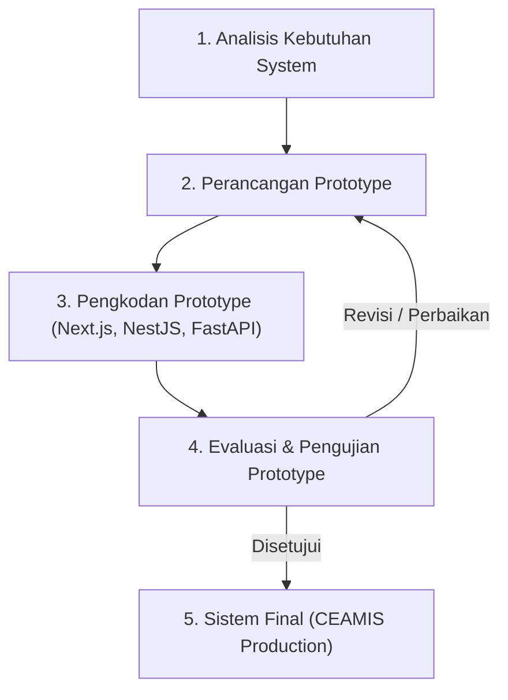

# BAB II
# LANDASAN TEORI

## A. Konsep Sistem Informasi dan Manajemen Keuangan Personal

### 1. Sistem Informasi
Sistem informasi dapat didefinisikan sebagai kombinasi dari teknologi informasi, data, manusia, dan prosedur yang terorganisir untuk mengumpulkan, memproses, menyimpan, dan menyebarkan informasi guna mendukung pengambilan keputusan dan pengendalian dalam suatu organisasi maupun individu [SITASI: Konsep Sistem Informasi]. Dalam konteks manajemen keuangan personal, sistem informasi bertindak sebagai media pengolahan data transaksi mentah (pemasukan dan pengeluaran) menjadi informasi analitis yang bermanfaat bagi pengguna dalam mengevaluasi kondisi finansial mereka.

### 2. Manajemen Keuangan Personal dan Literasi Keuangan
Manajemen keuangan personal (*personal financial management*) adalah proses perencanaan, penganggaran, pencatatan, dan pengendalian sumber daya keuangan individu untuk mencapai tujuan hidup finansial yang stabil [SITASI: Financial Management]. Literasi keuangan (*financial literacy*) merujuk pada pengetahuan, keterampilan, dan keyakinan yang mempengaruhi sikap dan perilaku individu untuk meningkatkan kualitas pengambilan keputusan keuangan. Rendahnya literasi keuangan pada mahasiswa dan Generasi Z acapkali memicu perilaku *impulsive buying*, *doom spending*, serta tingginya pengeluaran pada komponen *latte factor* [SITASI: Impulsive Buying Gen-Z].

---

## B. Kecerdasan Buatan (Artificial Intelligence) dan Machine Learning

### 1. Artificial Intelligence (AI) dan Machine Learning (ML)
Kecerdasan Buatan (*Artificial Intelligence* / AI) merupakan cabang ilmu komputer yang berfokus pada pengembangan sistem yang mampu melakukan tugas-tugas yang membutuhkan kecerdasan manusia, seperti pengenalan pola, analisis data, dan pengambilan keputusan [SITASI: Artificial Intelligence]. *Machine Learning* (ML) adalah sub-bidang AI yang memberikan kemampuan pada sistem untuk belajar secara otomatis dari data dan meningkatkan kinerjanya tanpa perlu diprogram secara eksplisit [SITASI: Machine Learning].

### 2. Deep Learning dan Custom Attention Layer
*Deep Learning* merupakan bagian dari *Machine Learning* yang memanfaatkan arsitektur jaringan saraf tiruan (*Artificial Neural Network*) multi-layer untuk mempelajari representasi data tingkat tinggi [SITASI: Deep Learning]. Pada sistem CEAMIS, perhitungan Skor Kesehatan Finansial (*Financial Health Score*) memanfaatkan model *Deep Learning* dengan *Custom Financial Attention Layer* berbasis Keras/TensorFlow. Mekanisme *Attention* memungkinkan model untuk memberikan bobot perhatian yang dinamis terhadap variabel keuangan yang paling kritis (seperti rasio tabungan dan rasio pengeluaran kebutuhan) sehingga menghasilkan evaluasi yang presisi dan transparan (*Explainable AI* / XAI).

### 3. Clustering (Unsupervised Learning)
*Clustering* adalah teknik pembelajaran tanpa pengawasan (*unsupervised learning*) yang bertujuan untuk mengelompokkan sekumpulan objek data ke dalam klaster-klaster berdasarkan tingkat kemiripan karakteristiknya [SITASI: Clustering Algorithm]. Pada CEAMIS, algoritma *clustering* digunakan untuk memetakan gaya hidup pengeluaran pengguna (*Spending Pattern Cluster*) ke dalam kategori seperti *Si Hemat*, *Si Impulsif*, atau *Si Boros*.

### 4. Classification (Supervised Learning)
*Classification* adalah teknik pembelajaran terawasi (*supervised learning*) di mana model dilatih menggunakan data berlabel untuk memprediksi kategori atau kelas dari data baru [SITASI: Supervised Classification]. Pada sistem ini, *Risk Profile Classifier* dilatih untuk memprediksi tingkat toleransi risiko investasi pengguna ke dalam kelas *Konservatif*, *Moderat*, atau *Agresif* berdasarkan indikator finansial pengguna.

### 5. Generative AI dan Large Language Model (LLM)
*Generative AI* merujuk pada teknologi kecerdasan buatan yang mampu menghasilkan konten baru dalam bentuk teks, gambar, atau kode berdasarkan data masukan (*prompt*) [SITASI: Generative AI]. *Large Language Model* (LLM) seperti Google Gemini 1.5 Flash dan Groq API digunakan pada chatbot CAMI (CEAMIS AI) untuk memberikan konsultasi keuangan interaktif yang dipersonalisasi sesuai *financial context* pengguna secara *real-time*.

---

## C. Konsep Gamifikasi (Gamification)

Gamifikasi (*gamification*) adalah penerapan elemen-elemen rancangan permainan (*game design elements*) pada konteks non-permainan (*non-game contexts*) untuk meningkatkan keterlibatan (*engagement*), motivasi, dan retensi pengguna [SITASI: Gamification Principles]. Dalam sistem informasi keuangan, gamifikasi berfungsi mengubah proses pencatatan keuangan yang terkesan membosankan menjadi aktivitas yang interaktif dan menyenangkan. Elemen-elemen gamifikasi yang diterapkan dalam CEAMIS meliputi:
1. **Poin Pengalaman (XP / Experience Points):** Proksi kuantitatif dari tingkat keaktifan dan kedisiplinan pengguna.
2. **Level:** Indikator tingkatan progresif yang dicapai pengguna seiring bertambahnya pengumpulan XP.
3. **Streak Harian:** Mekanisme psikologi positif untuk membangun kebiasaan pencatatan beruntun setiap harinya.
4. **Lencana Pencapaian (Badges):** Penghargaan visual atas pencapaian target keuangan atau penyelesaian modul edukasi tertentu.

---

## D. Framework dan Teknologi Pengembangan

### 1. Next.js dan React
Next.js adalah *framework* aplikasi web React tingkat lanjut berbasis Node.js yang mendukung fitur *Server-Side Rendering* (SSR), *Static Site Generation* (SSG), serta *Server Actions* [SITASI: Next.js Architecture]. Arsitektur Next.js App Router yang berbasis TypeScript memungkinkan pembuatan antarmuka pengguna yang cepat, modular, dan responsif.

### 2. NestJS
NestJS adalah *framework* backend Node.js terstruktur yang dibangun di atas Express.js dan menggunakan bahasa TypeScript [SITASI: NestJS Framework]. NestJS menerapkan pola arsitektur *Dependency Injection* (DI) dan arsitektur modular yang memudahkan pembuatan API yang terstruktur dan berskala besar.

### 3. FastAPI (Python)
FastAPI adalah *framework* web Python modern berkinerja tinggi yang dirancang khusus untuk membangun *RESTful API* berbasis standar Python *type hints* [SITASI: FastAPI Microservices]. Dalam sistem CEAMIS, FastAPI digunakan sebagai *microservice* khusus untuk menangani proses komputasi inferensi model *Machine Learning* dan *Deep Learning*.

### 4. Supabase PostgreSQL dan Prisma ORM
Supabase adalah layanan basis data relasional berbasis PostgreSQL tingkat lanjut yang menyediakan fitur autentikasi (*Supabase Auth*), *Row Level Security* (RLS), dan manajemen koneksi [SITASI: Supabase Platform]. Prisma ORM bertugas sebagai lapisan perantara (*Object-Relational Mapping*) berkecepatan tinggi yang menghubungkan aplikasi Next.js/NestJS ke basis data PostgreSQL secara *type-safe*.

### 5. Neo-Brutalist UI Design System
*Neo-Brutalisme* adalah tren desain antarmuka pengguna (UI) modern yang ditandai dengan penggunaan warna-warna kontras tinggi yang tegas, batas garis (*border*) tebal berwarna hitam, bayangan padat (*solid box-shadow*), serta tipografi yang mencolok [SITASI: Neo-Brutalist UI]. Gaya desain ini sengaja dipilih pada CEAMIS untuk memberikan kesan yang segar, lugas, dan menarik bagi karakteristik Generasi Z.

---

## E. Metode Pengembangan Perangkat Lunak (Metode Prototyping)

Metode pengembangan sistem yang digunakan dalam penelitian Tugas Akhir ini adalah **Metode Prototyping** [SITASI: Software Engineering Prototyping]. Metode ini sangat sesuai untuk pengembangan aplikasi web interaktif yang memerlukan integrasi multi-layanan dan pengujian antarmuka pengguna secara berulang.

Tahapan dalam Metode Prototyping mencakup:
1. **Analisis Kebutuhan (*Requirements Elicitation*):** Mengumpulkan seluruh kebutuhan fungsional dan non-fungsional dari pengguna dan arsitektur sistem.
2. **Perancangan Prototype (*Design Prototype*):** Membuat rancangan awal arsitektur, alur data (flowchart), skema basis data, dan maket antarmuka (*mockup* UI).
3. **Evaluasi & Pengkodan Prototype (*Build & Evaluate Prototype*):** Mengimplementasikan kode program pada *frontend*, *backend API*, serta *AI microservice* dan melakukan evaluasi internal.
4. **Pengujian & Penyerahan System (*Testing & Final System*):** Melakukan pengujian fungsionalitas sistem (*black-box testing*) serta pengujian inferensi kecerdasan buatan.

